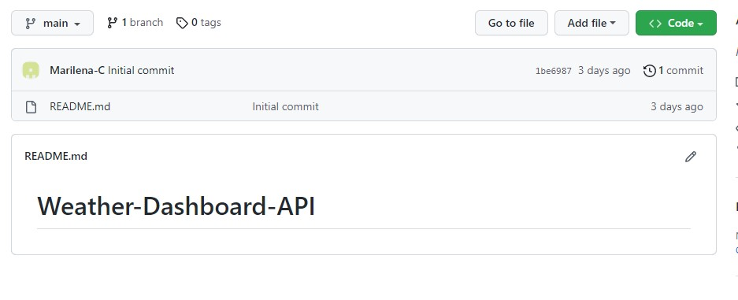
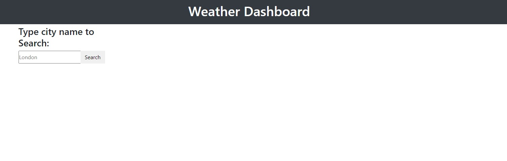

# Weather-Dashboard-API
## Server-API module Challenge Description
This API will provide the weather forcast, date and information regarding location coordinates.
The dashboard that will run in the browser and feature dynamically updated HTML and CSS.
The base URL for API calls should look like the following: https://api.openweathermap.org/data/2.5/forecast?lat={lat}&lon={lon}&appid={API key}.

Create a weather dashboard with form inputs.

When a user searches for a city they are presented with current and future conditions for that city and that city is added to the search history
When a user views the current weather conditions for that city they are presented with:

*The city name
*The date
*An icon representation of weather conditions
*The temperature
*The humidity
*The wind speed

When a user view future weather conditions for that city they are presented with a 5-day forecast that displays:

*The date
*An icon representation of weather conditions
*The temperature
*The humidity

When a user click on a city in the search history they are again presented with current and future conditions for that city

## Activities covered
Created the folder structure and the reset.css and script.js files;

Linked the css and js script with the index.html file;
Added the the required link tags in html file;

 ## Screenshots
First commintment:

https://github.com/Marilena-C/Weather-Dashboard-API/blob/main/assets/images/startingScrnshtGitH.jpg

https://github.com/Marilena-C/Weather-Dashboard-API/blob/main/assets/images/startingScreenshot.jpg

Second commintment:

 ## Links
GitHub repository: https://github.com/Marilena-C/Weather-Dashboard-API

Deployed website: https://marilena-c.github.io/Weather-Dashboard-API/